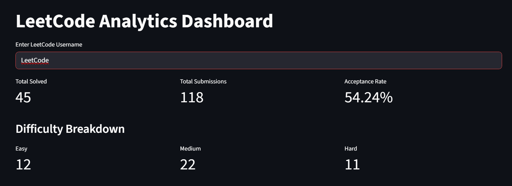
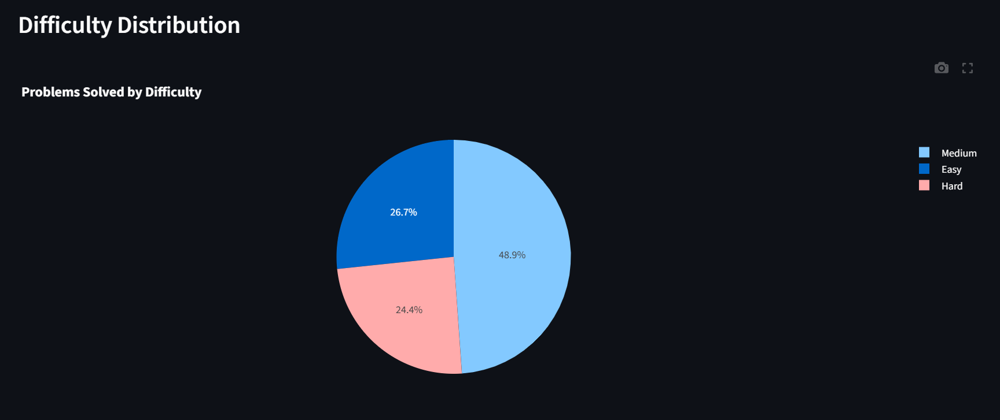
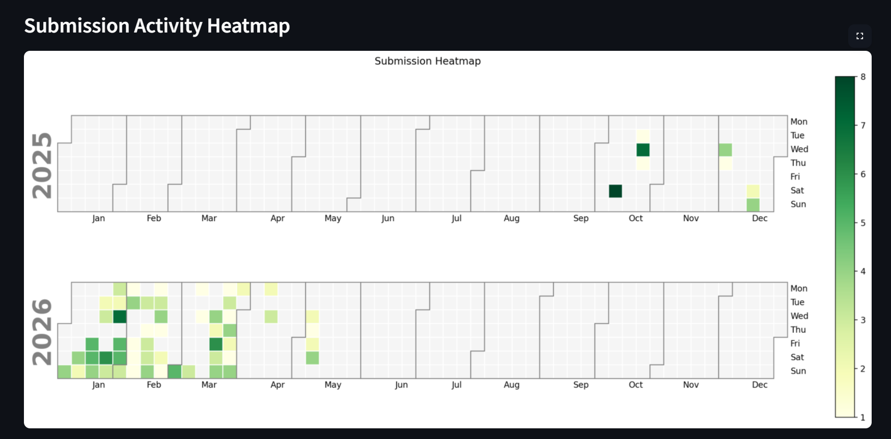
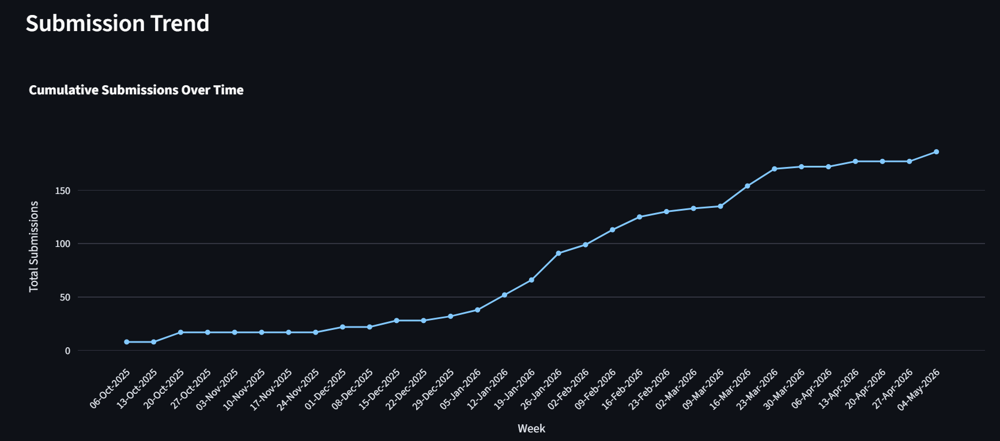

# 📊 LeetCode Analytics Dashboard

An interactive and visually rich analytics dashboard built using **Streamlit**, **Plotly**, and **Python** to analyze LeetCode problem-solving activity, submission trends, streaks, and coding language usage.

This project fetches real-time data from a public LeetCode API and presents it through beautiful charts, heatmaps, and analytics cards.

---

## 🚀 Live Demo

🔗 **Streamlit App:**  
[Add Your Streamlit App URL Here]


---

## 📸 Screenshots

### 🏠 Dashboard Overview

Add screenshot here.



---

### 📊 Difficulty Distribution

Add screenshot here.



---

### 📅 Submission Heatmap

Add screenshot here.



---

### 🔥 Submission Trend

Add screenshot here.



---

# ✨ Features

## 📈 Problem Solving Analytics

- Total solved problems
- Total submissions
- Acceptance rate
- Difficulty-wise problem count


---

## 💻 Programming Language Insights

- Language usage analysis
- Pie chart visualization
- Problem-solving distribution by language

---

## 📅 Submission Activity Tracking

- Monthly submissions
- Weekly activity trends
- Peak activity analysis

---

## 🔥 Streak Analytics

- Current streak calculation
- Maximum streak tracking

---

## 📊 Advanced Visualizations

- Interactive Plotly charts
- Calendar heatmaps
- Line charts
- Pie charts
- Bar charts

---


# 🛠 Tech Stack

| Technology | Usage |
|---|---|
| Python | Core programming language |
| Streamlit | Dashboard frontend |
| Plotly | Interactive visualizations |
| Pandas | Data manipulation |
| Requests | API handling |
| Matplotlib | Heatmap rendering |
| Calplot | Calendar heatmap |

---

# 📂 Project Structure

```text
leetcode-dashboard/
│
├── app.py
├── requirements.txt
├── README.md
├── LICENSE
├── .gitignore
│
└── screenshots/
    ├── dashboard_overview.png
    ├── difficulty_distribution.png
    ├── submission_heatmap.png
    └── streak_analytics.png
```

---

# ⚙️ Installation

## 1️⃣ Clone Repository

```bash
git clone https://github.com/shivam183-star/leetcode-dashboard.git
```

---

## 2️⃣ Navigate to Project Folder

```bash
cd leetcode-dashboard
```

---

## 3️⃣ Install Dependencies

```bash
pip install -r requirements.txt
```

---

## 4️⃣ Run Streamlit App

```bash
streamlit run app.py
```

---

# 🌐 API Used

This project uses the public LeetCode API:

```text
https://alfa-leetcode-api.onrender.com
```

### Endpoints Used

- `/solved`
- `/language`
- `/calendar`

---

# 📊 Dashboard Analytics Included

##  KPI Metrics

- Total solved problems
- Total submissions
- Acceptance rate

---

##  Difficulty Analysis

- Easy solved problems
- Medium solved problems
- Hard solved problems

---

##  Language Analysis

- Most used programming languages
- Language distribution charts

---

##  Submission Analytics

- Monthly submission trends
- Daily activity analysis
- Weekly activity tracking

---

##  Peak Activity Insights

- Most active day
- Most active week
- Most active month

---

##  Streak Insights

- Current streak
- Maximum streak

---

##  Heatmap Visualization

- GitHub-style calendar heatmap
- Submission density visualization

---

# 🎯 Future Improvements

Planned upgrades for future versions:

- Contest analytics
- Contest rating progression graph
- User profile section
- Topic-wise solved problems

---

# 🤝 Contributing

Contributions are welcome.

If you'd like to improve this project:

1. Fork the repository
2. Create a feature branch
3. Commit your changes
4. Push the branch
5. Open a Pull Request

---

# 📄 License

This project is licensed under the [MIT License](LICENSE).

---

# 👨‍💻 Author

## Shivam Singh

### Connect with Me

- [GitHub](https://github.com/shivam183-star)
- [LinkedIn](https://www.linkedin.com/in/shivam-singh-15b79a31a/)
---

# ⭐ Support

If you found this project useful:

- Give it a ⭐ on GitHub
- Share it with others
- Fork the repository

---

# 📌 Note

This project is intended for educational and portfolio purposes.

LeetCode data belongs to their respective owners.
